# Nginx-k8s-Tshoot
This Projects Demonstrates How to Troubleshoot Issues with Nginx Application in Kubernetes.

## Requirements
* Minikube should be up and running
* Basic understanding of kubernetes and how to use kubectl
* Know how to use any text editor, vi, vim or nano.

## Set UP ENV

* Start minikube
* Run `minikube start` to initialise minikube node on your computer system.

## Check your cluster status to be sure your minikube node is up and running

* Run `minikube status` 

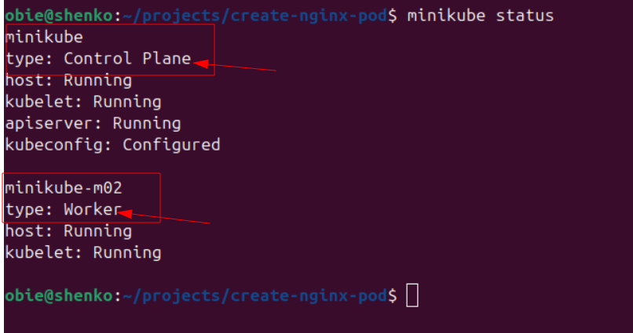

## Create Alias for kubectl key. This simply means you use 'k' instead of the full 'kubectl' keyword when running the command.

* run `alias k=kubectl`

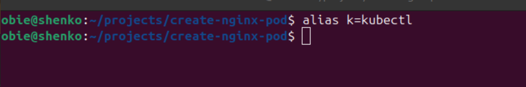

## Export dry run command

* Run `export do="--dry-run=client -o yaml`

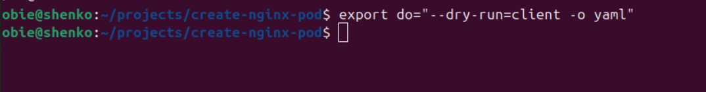

## Breakdown of the command

* export do =  : create an ENV called do
* do stores a value --dry-run=client -o yaml
* You can now type $do instead of --dry-run=client -o yaml
* --dry-run=client means Just prepare it, don't actually do it yet
* -o yaml means Print it out as yaml

## Create namespace 'dev' if not existing

## Create the web-pod yaml (dry run)
* Run ` k run web-pod --image=nginx --namespace=dev --port=80 $do > pod.yaml`
* This will just create the yaml file and save it as pod.yaml

## View the dry-run yaml file

* Run `cat pod.yaml` to view the file on terminal

## Create the pod from yaml

* Run `k apply -f pod.yaml` to create the web-pod.

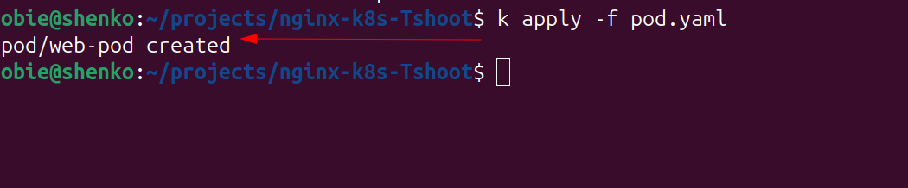

## Check pod status

* To check if the pod is running `k get pods -n dev`

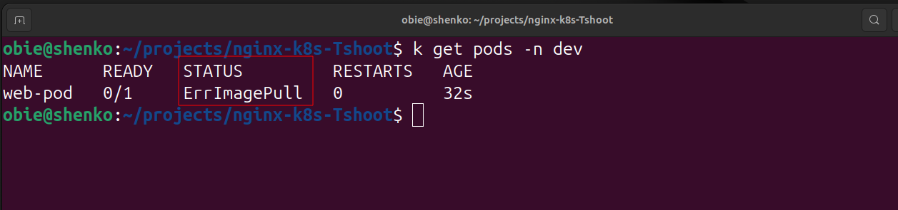

## TroubleShooting

### The pod web-pod has 'ErrImagePull' error. 

* Run `k describe pod web-pod -n dev` to see more detailed pod status

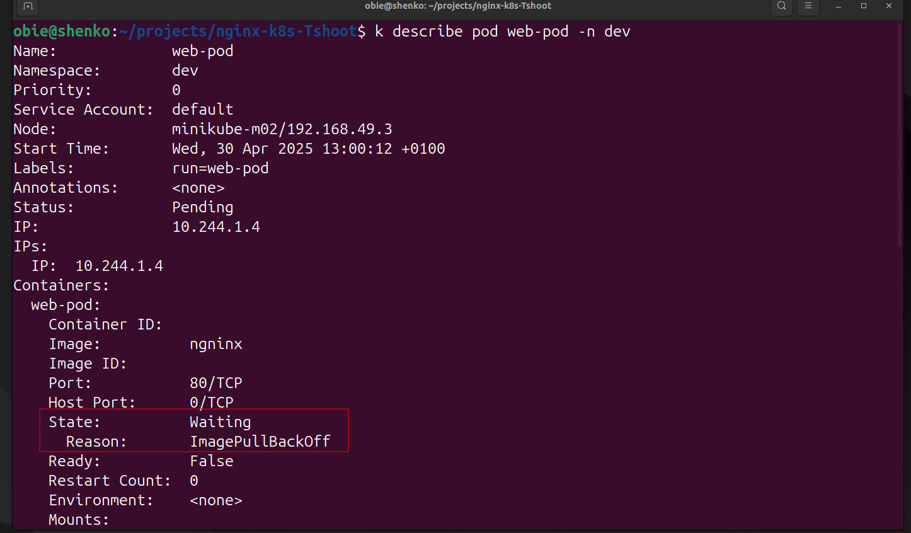

### Status of the pod says 'waiting' and the reason is  **ImagePullBackOff**.
* Run `k logs web-pod -n dev` to view pod logs

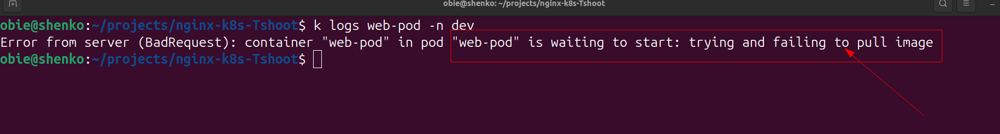

### The *ImagePullBackOff* error is a common error message in Kubernetes that occurs when a container running in a pod fails to pull the required image from a container registry. This error can occur for a variety of reasons, including network connectivity issues, incorrect image name or tag, missing credentials, or insufficient permissions.
Scroll down to see more information about the error.

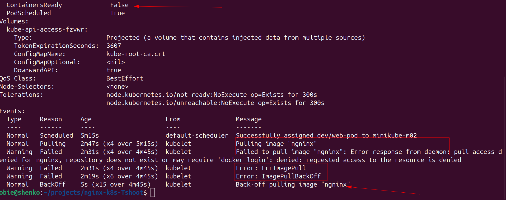

### Message column says *Failed to pull image "ngninx"...* Looking closely, we see that we have mis spelt nginx to be ngninx.

* Run `cat pod.yaml` to confirm mis spelling.

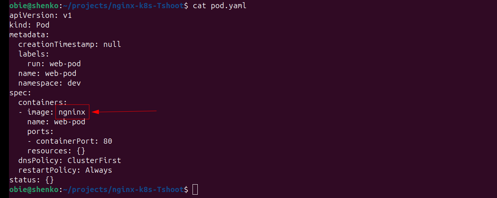

### Nginx is not correctly spelt as seen from the output of the previous command.

* Use vi text editor to correct it. Run `vi pod.yaml`

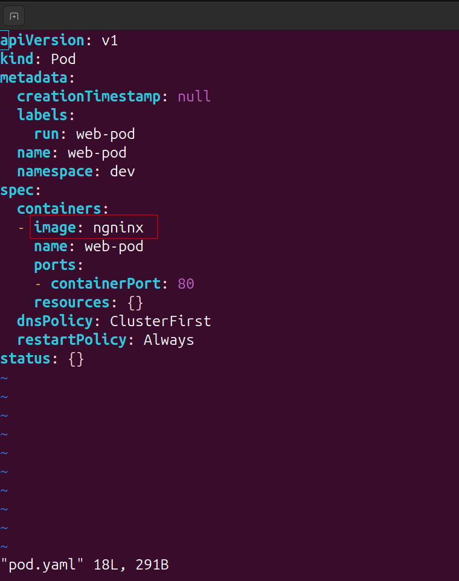

* Change image value under container to **nginx**

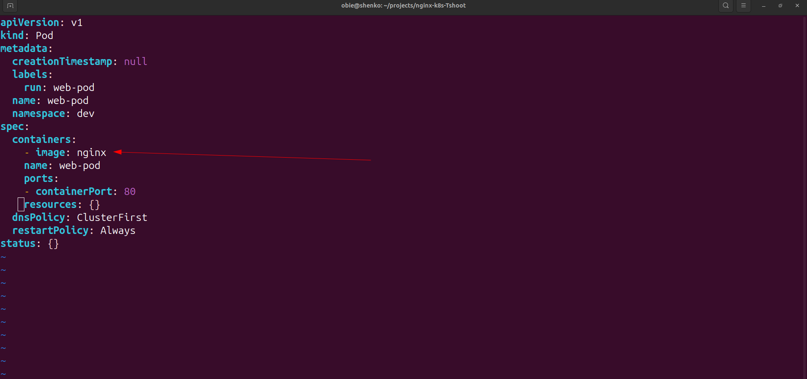

* Run `k apply -f pod.yaml` again having corrected the error

* Another error **converting YAML to JSON**, It appears we have altered yaml file format.Lets view and format the file again.

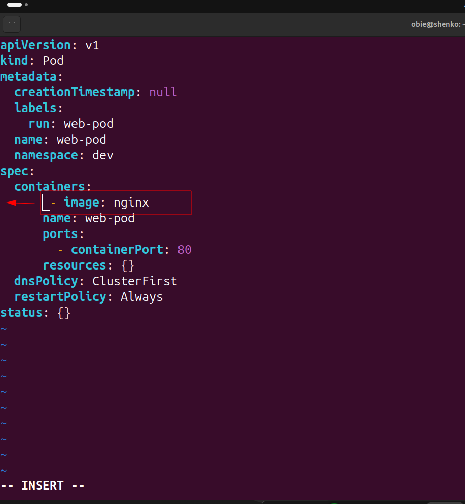

* Move the image indentation back as indicated to look exactly as the pic below

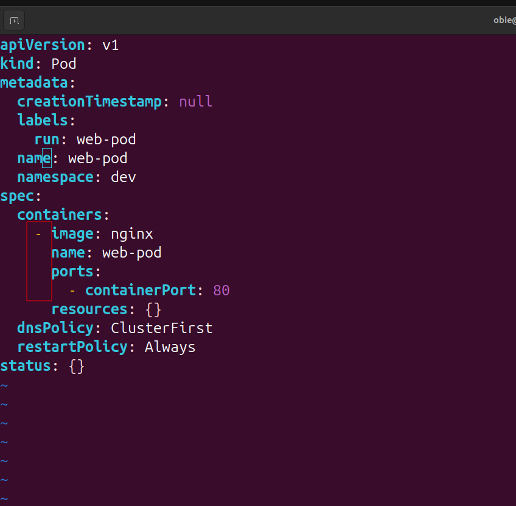

* Run `k apply -f pod.yaml` again
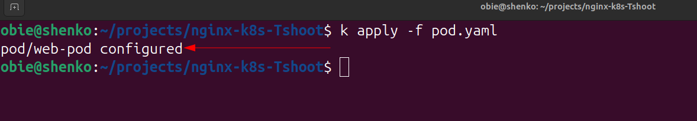

### Notice that the command returned *pod/web-pod configured*

### To dig a little deeper as to understand if the app is running as desired.

* Run `k describe pod web-pod -n dev` 

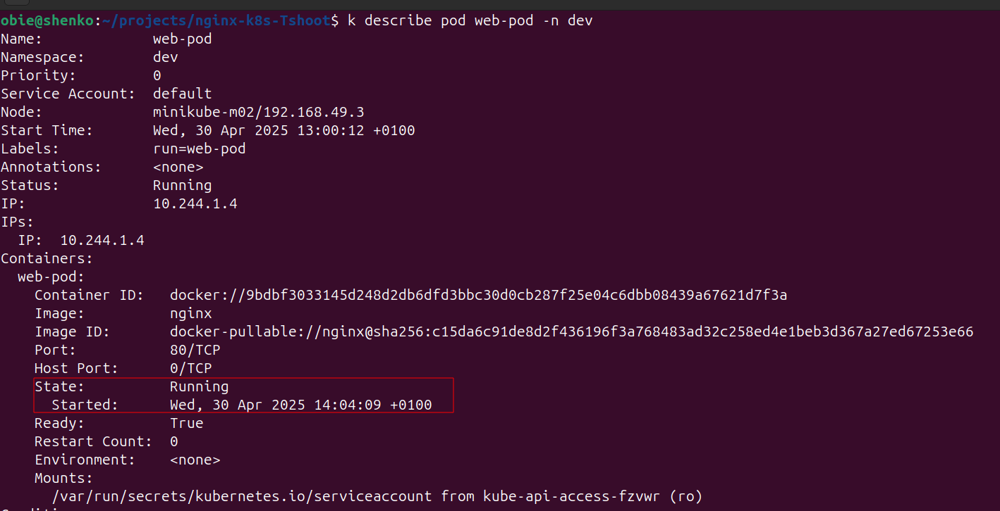

### Pod status indicates the pod is up and running, but when you scroll to check for errors, you see that imagepullback error persists.

### Verify Image name in the pod

* Run `k get pod web-pod -n dev -o=jsonpath="{.spec.containers[*].image}"`

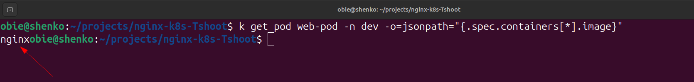

### The image name on pod is correct as the above output indicates.
### Though i ahve corrected the image name but i did not delete the initisl pod so k8s still running the pod with wrong image name.

* To delete existing pod run `k delete pod web-pod -n dev`

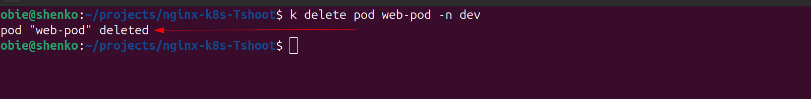

* Run `k apply -f pod.yaml` to create the pod again.

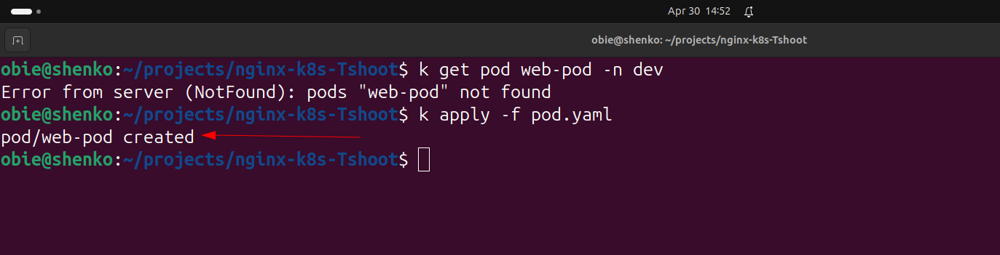

### The pod have been created successful. Let me run other T-shhot command to ascertain pod is running.

* Run `k get pods -n dev` to see pod details.

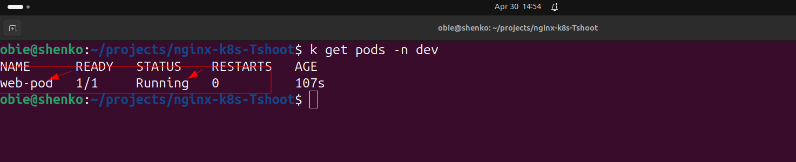

### Pod appears to be running now.

* Run `k describe pod web-pod -n dev` to see more pod details.

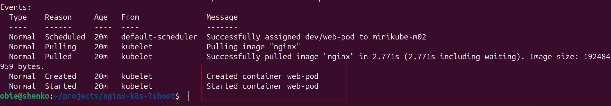

### Details in the message column confirm the pod is up and running.

* To view pod logs Run `k get logs web-deb -n dev

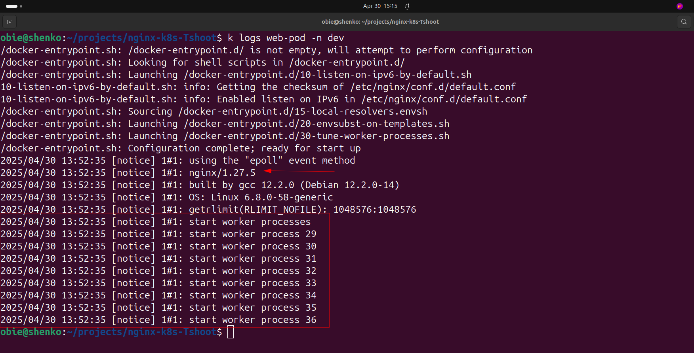

### Another proof that the is runing well

### Now we can login to the pod bash.

* Run `k exec -it web-pod -n dev --/bin/bash`

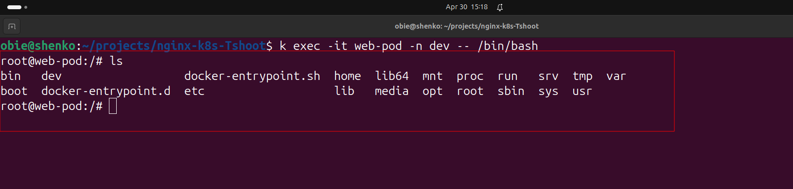

### Pod runs successfully.

## Expose nginx Service

### NodePort will be used to expose the service. Only for development purpose.

* Run `kubectl expose pod web-pod --port=80 --type=NodePort -n dev
` to expose the app port
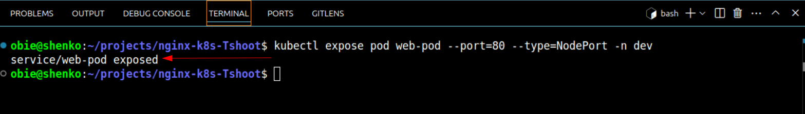

* Run `minikube service web-pod -n dev --url` to get the url
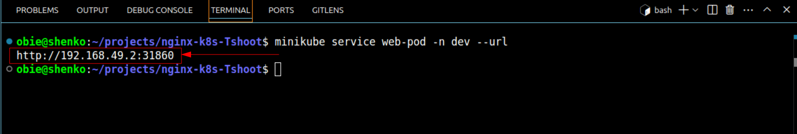

* Copy the entire url port number inclusive to the browser. You should nginx home page.

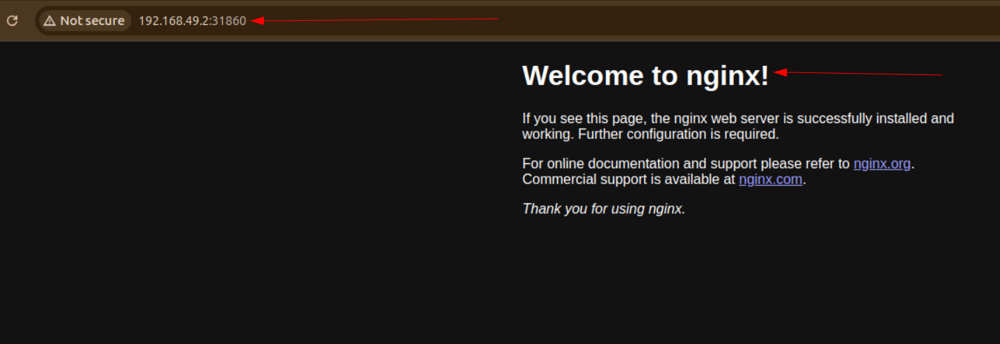

